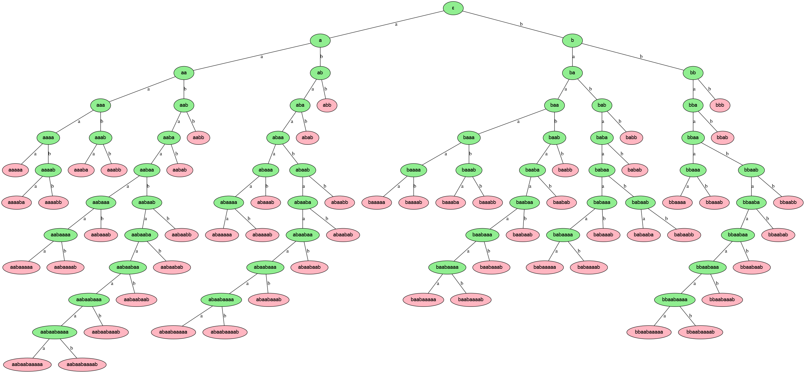
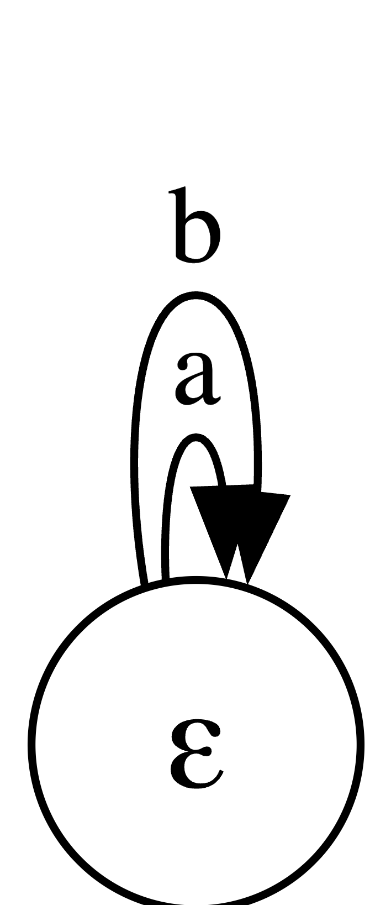
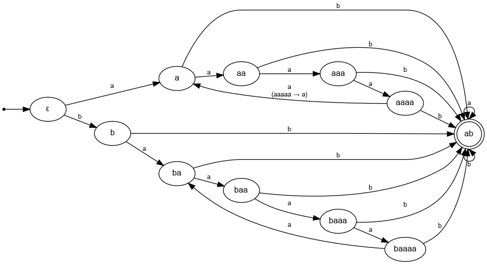

# ЛАБОРАТОРНАЯ РАБОТА 1

## Задание

По имеющейся **SRS** требуется определить:

- **Завершимость**.
- **Конечность классов эквивалентности по НФ**
  (для эквивалентностей считаем, что правила применяются **в обе стороны**).
  Если классов конечное число — построить **минимальную** систему переписывания, им соответствующую.
- **Локальную конфлюэнтность** и **пополняемость по Кнуту–Бендиксу**.

---

## Исходная система правил (SRS)

```text
bbb → bab
abab → bab
abba → aba
babb → abb
bbab → bab
aaaaa → a
aaaba → bba
aaaabb → bb
abb → abaaaa
abaaab → ab
baaaab → bab
baaabb → ε
bbaaaa → bb
bbaaab → aaaab
baabaab → baaab
babaaba → bab
babaabb → babaaa
```

---

## 1) Система незавершима (нетерминируема)

Докажем, что исходная SRS не завершаема — достаточно привести цикл редукций (слово, которое восстанавливается после конечного числа применений правил).

Возьмём слово `abbbab` и выполним следующие редукции (каждый шаг — формат `исходное -> результат (по правилу LHS -> RHS)`):

```text
abbbab  -> abaaaabab   (по правилу `abb -> abaaaa`)
abaaaabab -> abaaabab  (по правилу `abab -> bab`)
abaaabab -> abbbab     (по правилу `aaaba -> bba`)
```

Итого имеем цепочку

```text
abbbab ->* abbbab
```

**Вывод:** существует нетривиальный цикл редукций, значит система **нетерминируема (не завершается)**.

---

## **2) Конечность классов эквивалентности по нормальным формам**

**Дерево-доказательство.** Построено порождающее дерево слов от ε: рёбра — дописывание `a`|`b`.
Раскраска: зелёные — НФ (ни одно ориентированное правило неприменимо), розовые листья — переписываются в уже встречавшиеся листья и не дают новых НФ.

На внешней границе дерева появляются только розовые листья — новых зелёных узлов нет. Следовательно, множество НФ **конечно**. Фактически получено **54** нормальных форм, значит и число классов эквивалентности по НФ конечно (равно 54).


---

## 3) Локальная конфлюэнтность и пополняемость (Кнут–Бендикс)

### 3.1 Замечание по применимости леммы Ньюмана

Лемма Ньюмана утверждает, что для **завершаемой** системы терминируемость + локальная конфлюэнтность ⇔ глобальная конфлюэнтность.
Но у нас в пункте 1 было показано, что SRS **не завершаема** (найден цикл), поэтому **нельзя** опираться на лемму Ньюмана: отсутствие завершимости лишает этой эквивалентности силы, и локальная конфлюэнтность не даёт автоматически глобальной.

Таким образом проверку конфлюэнтности и пополнение по Кнуту–Бендиксу нужно делать прямо: искать критические пары и пытаться их разрешить (путём добавления правил), при этом понимать, что процедура пополнения может и не завершиться, если система порождает бесконечные новые критические пары или сама содержит самовстраивающиеся шаблоны.

---

### 3.2 Локальная конфлюэнтность — контрпример

Рассмотрим критическую пару на слове `bbaaabb`.

1. Применяя `baaabb → ε` (внутри):

```
bbaaabb → b
```

2. Применяя `bbaaab → aaaab` (сдвиг редукции), затем `aaaabb → bb`:

```
bbaaabb → aaaabb → bb
```

В результате получаем две различные нормальные формы `b` и `bb`, которые не сводимы друг к другу. Значит система **локально не конфлюэнтна** (есть критическая пара, не пересекающаяся).

---

### 3.3 Пополнение по Кнуту–Бендиксу — идея и конкретные критические пары

Поскольку система локально не конфлюэнтна, применим процедуру Кнут–Бендикса: вычисляем все перекрытия левых частей правил (critical overlaps), для каждой критической пары пытаемся свести обе ветки редукций к общему нормальному виду; если НФ различны — добавляем направленное правило, ориентирующее одно НФ в другое (обычно справа короче/«меньше» по выбранному порядку). Повторяем, пока остаются нерешённые пары (или пока процесс не остановлен вручную).

#### Критическая пара 1

Возьмём базовое слово `baaabb`.

1. Прямое применение правила:

```
baaabb → ε
```

2. Альтернативная редукция:

```
baaabb → baaabaaaa        (по правилу abb → abaaaa)
baaabaaaa → bbbaaaa       (по правилу abaaaa → bba)
bbbaaaa → bbb             (по правилу bbaaaa → bb)
bbb → bab                 (по правилу bbb → bab)
```

Получаем разные нормальные формы: `ε` и `bab`.

Чтобы они сошлись, добавляем новое правило:

```
bab → ε
```

(ориентираем `bab` в `ε`).

> Замечание. Добавление правила `bab→ε` изменяет глобальную структуру системы: любые вхождения `bab` теперь редуцируются до `ε`, что влияет на последующие критические пары.

#### Последствия (последующие критические пары)

Примерно так теперь редуцируются строки:

```
bbb → bab → ε
abab → bab → ε
bbab → bab → ε
baaaab → bab → ε
babaaba → bab → ε
babaabb → babaaa → aaa
```

---

#### Критическая пара 2

Возьмём базовое слово `bbab`.

1. Первый вариант редукции:

```
bbab → bab → ε (по правилам bbab → bab, а затем bab → ε)
```

2. Второй вариант редукции:

```
bbab → b (по правилу bab → ε)
```

Получаем разные нормальные формы `b` и `ε`.  
Чтобы они сошлись, добавляем новое правило:

```
b → ε
```

---

#### Критическая пара 3

Возьмём базовое слово `abab`.

1. Первый вариант редукции:

```
abab → bab → ε (по правилам abab → bab, а затем bab → ε)
```

2. Второй вариант редукции:

```
abab → a (по правилу bab → ε)
```

Получаем разные нормальные формы `a` и `ε`.  
Чтобы устранить конфликт, добавляем новое правило:

```
a → ε
```

---

Таким образом серия добавлений для сходимости этих критических пар:

```
bab → ε
b   → ε
a   → ε
```

---

## 4) Минимизация системы (после пополнения)

После того как процедура пополнения была выполнена (и все критические пары, рассматриваемые нами вручную, были устранены), получилась расширенная система, в которой множество слов сокращается до пустого слова. Минимизация этой системы сводится к удалению транзитивных и избыточных правил — остаются простейшие генераторы редукции в ε:

```text
a → ε
b → ε
```

## 

## 5) Инварианты и пересмотр SRS

При наличии правила

```
baaabb → ε
```

все строки переписываются в `ε`, поэтому инварианты становятся **тривиальными** — любые свойства слов (например, количество `a` или `b`) перестают иметь смысл, так как каждая строка сводится к пустому слову.

Чтобы сделать анализ осмысленным, **исключим правило `baaabb → ε`** и рассмотрим изменённую систему, а также переупорядочим её (из `abb → abaaaa` получаем `abaaaa → abb`), чтобы избавиться от цикла, тем самым сделав систему завершаемой и можно было получить эквивалентную минимальную систему для тестирования.

---

## Исходная система (без `baaabb → ε` и переупорядоченная)

```text
bbb → bab
abab → bab
abba → aba
babb → abb
bbab → bab
aaaaa → a
aaaba → bba
aaaabb → bb
abaaaa → abb
abaaab → ab
baaaab → bab
bbaaaa → bb
bbaaab → aaaab
baabaab → baaab
babaaba → bab
babaabb → babaaa
```

---

## 5.1) Пополнение по Кнуту–Бендиксу

Так как система не является локально конфлюэнтной, применим процедуру **пополнения по Кнуту–Бендиксу**, чтобы устранить критические пары и добиться конфлюэнтности.

---

### Критическая пара 1

Возьмём слово `abaaaba`.

```
abaaaba → abbba        (по правилу aaaba → bba)
abbba → ababa          (по правилу bbb → bab)
ababa → baba           (по правилу abab → bab)
baba — НФ
```

```
abaaaba → aba          (по правилу abaaab → ab)
aba — НФ
```

Критическая пара: `baba` и `aba`.
Добавляем новое правило:

```
baba → aba
```

---

### Критическая пара 2

Возьмём слово `babaaab`.

```
babaaab → bab          (по правилу abaaab → ab)
bab — НФ
```

```
babaaab → abaaab       (по правилу baba → aba)
abaaab → ab            (по правилу abaaab → ab)
ab — НФ
```

Критическая пара: `bab` и `ab`.
Добавляем новое правило:

```
bab → ab
```

---

### Критическая пара 3

Возьмём слово `abab`.

```
abab → bab             (по правилу abab → bab)
bab → ab               (по правилу bab → ab)
ab — НФ
```

```
abab → aab             (по правилу bab → ab)
aab — НФ
```

Критическая пара: `aab` и `ab`.
Добавляем новое правило:

```
aab → ab
```

---

### Критическая пара 4

Возьмём слово `aaababaaba`.

```
aaababaaba → aababaaba        (по правилу aab → ab)
aababaaba → ababaaba          (по правилу aab → ab)
ababaaba → babaaba            (по правилу abab → bab)
babaaba → bab                 (по правилу babaaba → bab)
bab → ab                      (по правилу bab → ab)
ab — НФ
```

```
aaababaaba → abbaaba        (по правилу aaaba → bba)
abbaaba → abaaba            (по правилу abba → aba)
abaaba → ababa              (по правилу aab → ab)
ababa → baba                (по правилу abab → bab)
baba → aba                  (по правилу baba → aba)
aba — НФ
```

Критическая пара: `aba` и `ab`.
Добавляем новое правило:

```
aba → ab
```

---

### Критическая пара 5

Возьмём слово `bbbaaaa`.

```
bbbaaaa → babaaaa         (по правилу bbb → bab)
babaaaa → babb            (по правилу abaaaa → abb)
babb → abb                (по правилу bab → ab)
abb — НФ
```

```
bbbaaaa → bbb            (по правилу bbaaaa → bb)
bbb → bab                (по правилу bbb → bab)
bab → ab                 (по правилу bab → ab)
ab — НФ
```

Критическая пара: `abb` и `ab`.
Добавляем новое правило:

```
abb → ab
```

---

### Критическая пара 6

Возьмём слово `bbaaabb`.

```
bbaaabb → aaaabb         (по правилу bbaaab → aaaab)
aaaabb → bb              (по правилу aaaabb → bb)
bb — НФ
```

```
bbaaabb → bbaabb         (по правилу aab → ab)
bbaabb → bbabb           (по правилу aab → ab)
bbabb → babb             (по правилу bab → ab)
babb → abb               (по правилу bab → ab)
abb → ab                 (по правилу abb → ab)
ab — НФ
```

Критическая пара: `bb` и `ab`.
Добавляем новое правило:

```
bb → ab
```

---

## Пополненная система

```text
bbb → bab
abab → bab
abba → aba
babb → abb
bbab → bab
aaaaa → a
aaaba → bba
aaaabb → bb
abb → abaaaa
abaaab → ab
baaaab → bab
bbaaaa → bb
bbaaab → aaaab
baabaab → baaab
babaaba → bab
babaabb → babaaa
baba → aba
bab → ab
aab → ab
aba → ab
abb → ab
bb → ab
```

---

## 5.2) Минимизация системы

После пополнения система сводится к компактному виду:
удаляем избыточные и транзитивные правила, оставляя минимальный набор, сохраняющий эквивалентность по нормальным формам.

**Минимальная система переписывания:**

```text
aaaaa → a
aba → ab
aab → ab
bab → ab
bb → ab
```

## 

---

**Вывод:**
После удаления правила `baaabb → ε` система перестала быть тривиальной. А после переупорядоченная система перестала быть нетерминируемой.
Пополнение по Кнуту–Бендиксу устранило критические пары, а минимизация привела к компактной конфлюэнтной системе, эквивалентной получившейся по нормальным формам.

---

## 5.3) Инварианты

Минимальная система переписывания имеет вид:

```
aaaaa → a
aba   → ab
aab   → ab
bab   → ab
bb    → ab
```

---

## **Инвариант 1: Наличие буквы `b`**

Во всех правилах буква `b` **никогда не исчезает полностью**. Слова, содержащие `b`, не могут перейти в слова без `b`, и наоборот.

**Определение инварианта:**  
`has_b(w) = 1`, если `b` содержится в `w`  
`has_b(w) = 0`, если `b` не содержится в `w`

**Проверка:**

| Правило     | has_b(lhs) | has_b(rhs) | Сохраняется |
| ----------- | ---------- | ---------- | ----------- |
| `aaaaa → a` | 0          | 0          | ✓           |
| `aba → ab`  | 1          | 1          | ✓           |
| `aab → ab`  | 1          | 1          | ✓           |
| `bab → ab`  | 1          | 1          | ✓           |
| `bb → ab`   | 1          | 1          | ✓           |

✅ Инвариант выполняется для всех правил.

---

## **Инвариант 2: Остаток числа `a` по модулю 4 (для слов без `b`)**

Если слово **не содержит буквы `b`**, то к нему применимо только одно правило:

```
aaaaa → a
```

Это правило уменьшает число `a` на 4, поэтому сохраняется остаток по модулю 4.

**Определение инварианта:**  
`Φₐ(w) = количество_а(w) mod 4`, если `b` не содержится в `w`  
`Φₐ(w) = не определено`, если `b` содержится в `w`

**Проверка:**  
`Φₐ("aaaaa") = 5 mod 4 = 1`  
`Φₐ("a") = 1 mod 4 = 1`

✅ Инвариант сохраняется.

---

## **Инвариант 3: Нормальная форма слов, оканчивающихся на `b`**

Любое слово длиной ≥ 2, которое заканчивается на `b`, обязательно содержит одну из подстрок:

- `bb` → `ab`
- `bab` → `ab`
- `aab` → `ab`

и каждая из них **редуцируется в `ab`**.

Поэтому независимо от окружения конечный `b` "проталкивается" к редукции, и нормальная форма всегда:

`NF(w) = "ab"`, если `|w| ≥ 2` и последний символ `w` = `b`

**Определение инварианта:**  
`end_b_nf(w) = "ab"`, если `|w| ≥ 2` и последний символ = `b`  
`end_b_nf(w) = не определено`, иначе

✅ Таким образом, все длинные слова вида `...b` в минимальной SRS сводятся строго к `ab`.

---

## **Сводный инвариант**

`Inv(w) = (has_b(w), Φₐ(w), end_b_nf(w))`

---

## **Вывод**

Минимальная система обладает следующими устойчивыми свойствами:

1. **Наличие буквы `b`** никогда не исчезает при редукциях
2. Для слов без `b` сохраняется **остаток числа `a` по модулю 4**
3. Любое слово длиной ≥ 2, **оканчивающееся на `b`**, имеет нормальную форму **`ab`**

Эти инварианты полностью согласуются со структурой минимальной системы и корректно описывают её поведение.

---
